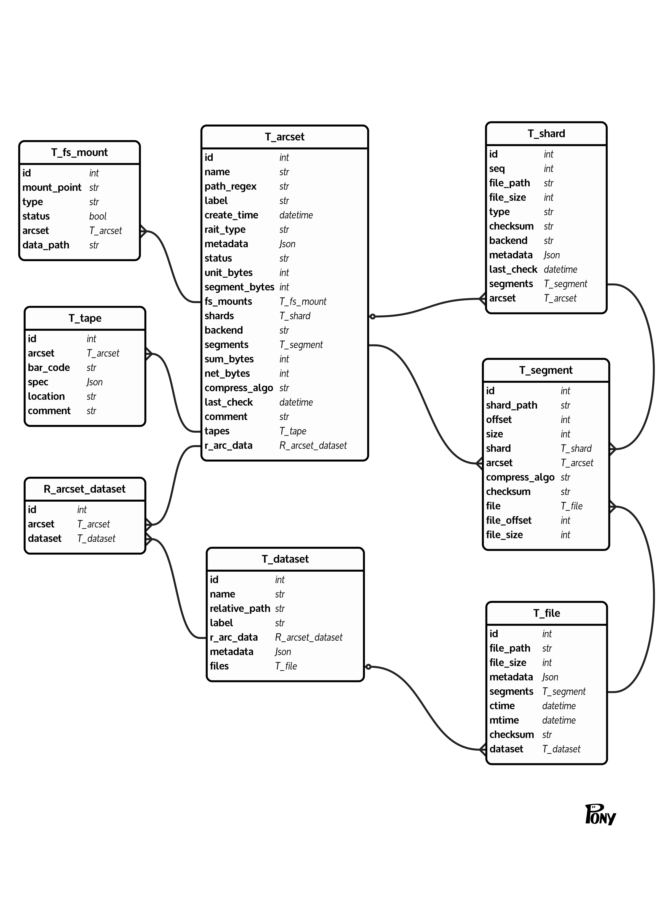

# packfs

## 一、系统简介
packfs通过将小文件通过文件系统打包成若个个大文件来减少磁盘碎片和提高性能。它提供了一个简单的接口来创建、读取和管理打包文件系统中的文件。
实现文件系统的打包,解压,以及系统的安装,卸载,统计等功能.
打包是通过将读取文件目录下的所有文件,将文件内容写入若干个大文件中,并记录每个文件在大文件中的位置和大小来实现的.
解压是通过读取大文件中的内容,根据记录的位置和大小来还原原始文件的内容.

## 二、系统模块功能

### 1. 打包模块

- 将给定目录下的所有文件打包成多个大文件。
- 记录每个文件在大文件中的位置和大小。
- 支持指定每个大文件的最大大小，以便更好地管理磁盘空间。

### 2. 解包模块

### 3. mount模块

### 4. umount模块

### 5. stat模块

## 三、系统设计

### 1. 数据库结构设计

ER图设计如下:


主要实体解释：


### 2. 文件系统设计 

## 四、系统安装

## 五、系统使用说明

### 1. 打包操作

```sh
packfs pack <source_directory> <output_directory> [max_file_size]
```

### 2. 解包操作
### 3. mount操作
### 4. umount操作
### 5. stat操作


## 六、系统性能分析
