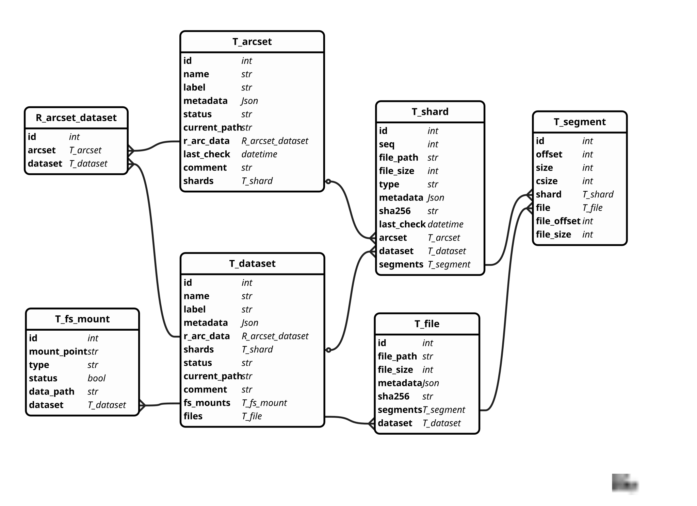

# packfs

## 一、系统简介
packfs通过将小文件通过文件系统打包成若个个大文件来减少磁盘碎片和提高性能。它提供了一个简单的接口来创建、读取和管理打包文件系统中的文件。
实现文件系统的打包,解压,以及系统的安装,卸载,统计等功能.

打包以 dataset 为粒度（shard 不跨 dataset），单个文件不拆分，通过 `shard_max_bytes` 控制每个 shard 的大小上限。
支持两种打包格式：**bin**（二进制拼接）和 **tar**（tar 归档），以及两种压缩模式：**shard 级**（整个 shard 压缩）和 **segment 级**（每个文件独立压缩）。
压缩算法支持 zstd 和 xz。

## 二、系统模块功能

### 1. 命令行工具

####  打包模块

- 将给定目录下的所有文件打包成多个 shard 大文件。
- 支持 bin 格式（二进制拼接）和 tar 格式（tar 归档）。
- 支持 zstd/xz 压缩，可选 shard 级或 segment 级。
- 记录每个 segment 在 shard 中的位置和大小。
- 支持指定 shard 最大字节数，控制分片粒度。

####  解包模块

- 从 shard 文件恢复原始文件，支持 bin 和 tar 两种格式。
- 自动处理 shard 级和 segment 级解压。

####  mount模块

####  umount模块

### 2. packfs文件系统


## 三、系统设计

### 1. 数据库结构设计

ER图设计如下:


主要实体解释：


#### dataset元数据

属性名       | 属性说明
----------- | ------------------------
num_files   | 文件总数量
total_bytes | 数据集总数据量（以字节计）

#### file元数据

属性名     | 属性说明
--------- | ------------------------
file_mode | 文件原始权限位
ctime     | 创建时间
mtime     | 最后修改时间

#### arcset元数据

属性名           | 属性说明
--------------- | -------------------------------
create_time     | 创建时间
shard_max_bytes | shard 的最大字节数
format          | 'bin' / 'iso' / 'tar'，打包格式，缺省 'bin'
compress        | 压缩配置，缺省空=不压缩。shard 级省略前缀，segment 级标注 `segment:`。例：`zstd`、`segment:zstd`、`zstd_seekable`、`segment:xz`、`xz`。`segment:*` 和 `zstd_seekable` 支持文件系统挂载
tape_max_bytes  | 对应磁带的大小（字节数）
ec              | Erasure Code 参数，例 '8+4'（x+y）
total_bytes     | 所有 dataset 中原始数据文件的总字节数
sum_bytes       | 所有 shard 的总字节数
net_bytes       | 所有数据 shard（排除 EC shard）的总字节数

#### shard元数据

属性名      | 属性说明
---------- | ------------------------
shard_type | 'DATA' / 'EC'，数据 shard 或 EC shard
data_bytes | 所有 segment 原始字节总和

### 3. 文件系统设计 

## 四、系统安装

## 五、命令行使用说明

### 1. 打包流程

```sh
# 1) 创建 dataset（递归扫描目录）
packfs dataset create --root-dir=/data/source [--name=my-ds]

# 2) 创建 arcset（关联 dataset，可选压缩和格式）
packfs arcset create --name=my-arc --target-root=/data/output \
  --dataset-ids=1 [--format=bin|tar] [--shard-max-bytes=1073741824] [--compress=zstd]

# 3) 生成 shard 定义文件（文件名自动反映格式和压缩模式）
#    bin 格式: 0000.bin.def / 0000.bin.zst.def / 0000.zst.bin.def
#    tar 格式: 0000.tar.def / 0000.tar.zst.def / 0000.zst.tar.def
packfs arcset gen-def --id=1 --target-root=/data/output

# 4) 打包 shard（从 .def 和 DB 自动获取路径）
packfs shard make --def-file=/data/output/0000.bin.zst.def
```

### 2. 解包操作

```sh
# 解包单个 shard
packfs shard unpack --shard-file=/path/to/0000.bin --target-root=/extract --arcset-id=1

# 解包整个 arcset
packfs arcset unpack --name=my-arc --source-root=/data/output --target-root=/extract
```

### 3. 数据集管理

```sh
packfs dataset list [--dataset-id=1] [--dataset-name=...]
```

详见 `cmd/cli/README.md`。


## 六、系统性能分析
